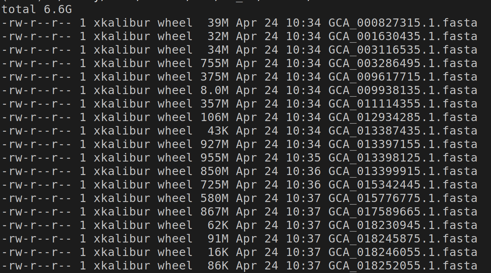
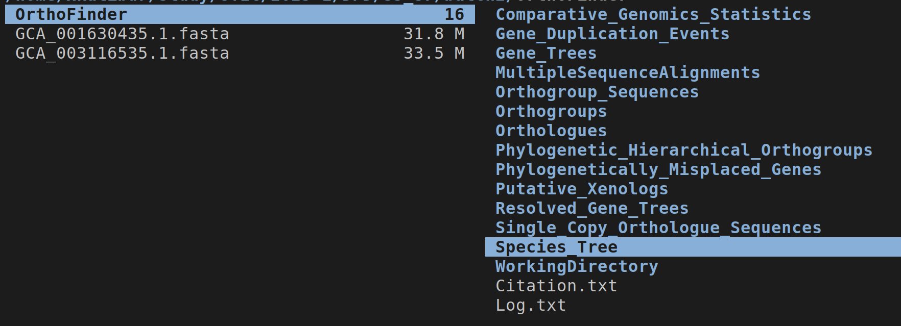
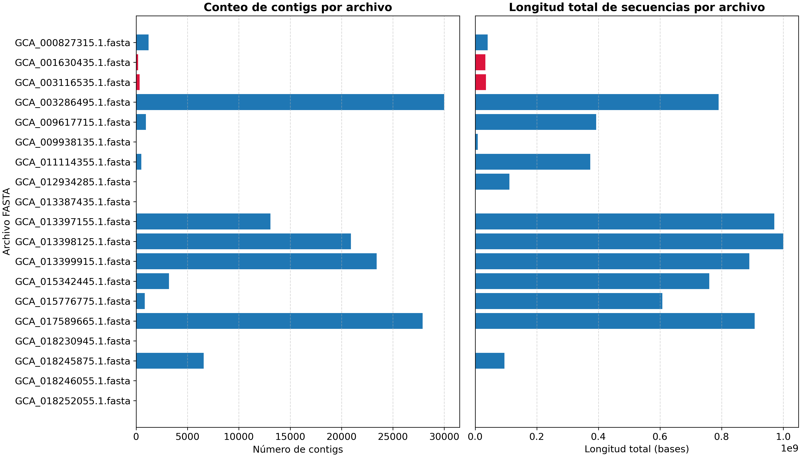
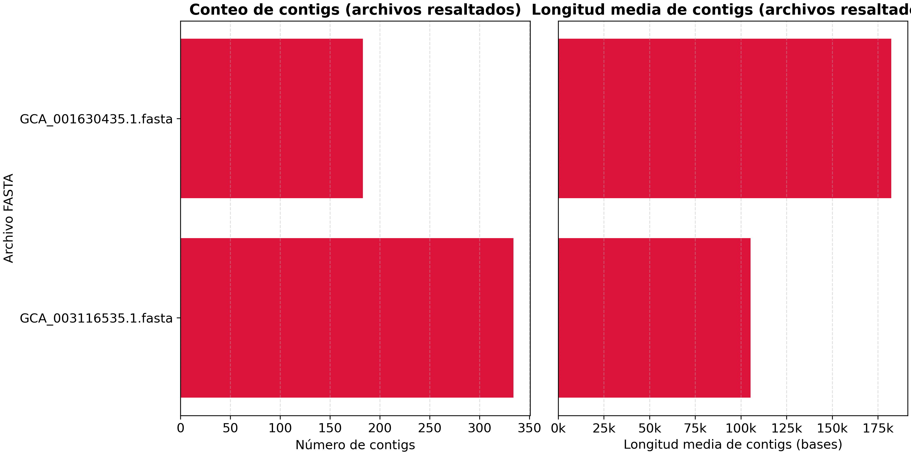
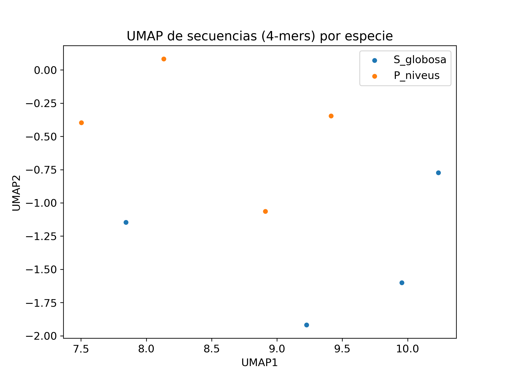
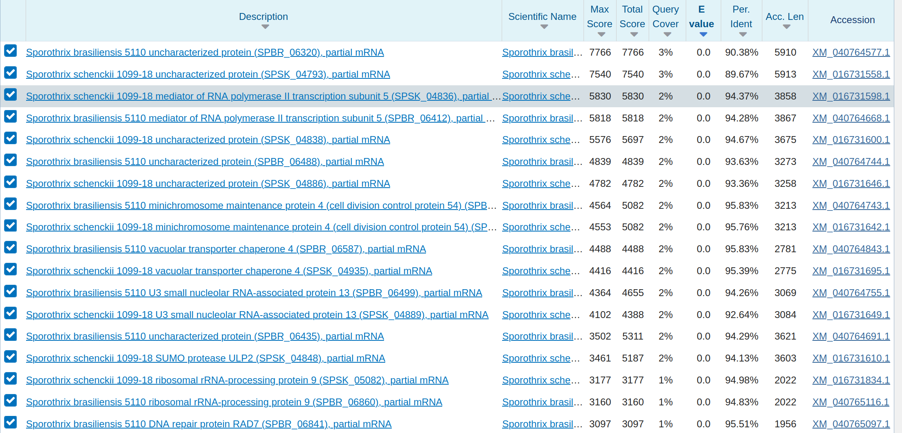

# PrevenIA

## Introduction and Data Preparation

En este informe exploraremos los datos utilizados para entrenar el modelo **Evo 2**.

Con este fin, descargaremos archivos del [dataset publicado en el paper](https://huggingface.co/datasets/arcinstitute/opengenome2/tree/main), este repositorio se maneja con git lfs (large file storage) y por lo tanto se descargarán los datasets con esta extensión.

```bash
git clone https://huggingface.co/datasets/arcinstitute/opengenome2
git lfs pull --include="fasta/ncbi_eukaryotic_genomes/batch1.tar"
git lfs pull --include="json/pretraining_or_both_phases/eukaryotic_genic_windows/windows_5kb_test_chunk1.jsonl.gz"
```

Después de correctamente descargar estos archivos, extraemos el archivo

```bash
tar -xvf batch1.tar
```

Para lograr conseguir Orthogroups y así responder a nuestras preguntas de investigación, recurriremos a la herramienta [Orthofinder](https://github.com/davidemms/OrthoFinder/). 
Esta herramienta utiliza otras herramientas externas para hacer el análisis, estas son: 

+ *blast+*: ```pacman -S blast+-bin```
+ *mafft*: compilar en [source](https://github.com/GSLBiotech/mafft#)
+ *diamond*: ```wget http://github.com/bbuchfink/diamond/releases/download/v2.1.11/diamond-linux64.tar.gz``` y extraer
+ *fasttree*: descargar el [binario](https://morgannprice.github.io/fasttree/FastTree) o compilar from source para conseguir la versión multi-threaded
+ *orthofinder*: descargar el último [release](https://github.com/davidemms/OrthoFinder/releases), compilar from source

Todos los binarios deben estar disponibles, de preferencia, en ```/usr/local/bin```


## Research Questions

- ¿Cuales secuencias son válidas para el análisis?
- ¿Cuál es y cómo se ve la relación entre las secuencias? (Orthogroups)
- ¿Qué relaciones son significativas? (Orthologs 1v1)
- ¿Los resultados generados son realmente válidos? (MSA)
- ¿Qué función cumplen estos grupos? ¿Es esta función importante?


## Data Selection 

Basandome en el paper de  ***Evo 2***, se buscó el dataset OpenGenome2 que junta el genoma de todos los reinos y especies. 
El dataset es open source y se puede encontrar en [HuggingFace](https://huggingface.co/datasets/arcinstitute/opengenome2/tree/main). 
Se escogió el archivo ```batch1.tar``` que se encuentra en la ubicación ```fasta/ncbi_eukaryotic_genomes/```. 
Este archivo contiene múltiples secuencias de las cuales escogeremos 2 para hacer el análisis.
A las secuencias elegidas, tendremos que descomprimirlas para que queden en formato **fasta**, que nos sirve para el análisis.


**Fig 1:** Secuencias extraidas

Note que los archivos son bastante grandes y que solo escogimos un subset pequeño del **batch1.tar**.

## Data Exploration and Analysis

Para empezar con el análisis, podemos recurriparar a las preguntas hechas anteriormente. 
Una posible relación entre las secuencias son sus Orthogroups, genes ortólogos, que son secuencias de aminoácidos que comparten 
una posible relación evolutiva. Ya habiendo instalado las herramientas anteriores, podemos hacer una evaluación en las secuencias de ADN.

En primera instancia, se intentó ejecutar el programa con las 19 secuencias con el siguiente comando

```bash
python orthofinder.py -a 8 -t 16 -M msa -T fasttree -S diamond -d -f ./batch1/ --fewer-files
```

Esto no dió resultado ya que el programa crasheo después de quedarse atrapado con el log: 

```bash
2025-04-27 02:33:35 : This may take some time....
2025-04-27 02:33:35 : Done 0 of 361 
```

. Algo importante a notar es que el número mostrado es el cuadrado de la cantidad de secuencias, siendo este algoritmo $\Theta(s^2)$ con s siendo la cantidad de secuencias. A causa de esto se pasó a reducir drásticamente la cantidad de secuencias a analizar. Llegando lamentablemente a un máximo de 2 secuencias. 

Entonces, la limitada CPU fué la razón por la que se escogieron solamente dos secuencias.

Esto también tuvo repercusiones en los datos finales que se pueden usar para análisis, ya que para hacer un 
MSA (Multi Sequence Alignment) o un Phylogenetic Tree se necesitan al menos 3 especies. 
Por esta razón, las carpetas *Gene_Trees*, *Phylogenic Hierarchical_Orthogroups*, entre otras, están vacias o con datos insuficientes para el análisis.


**Figura 2:** Output de Orthofinder


Para tener una prueba concreta de por qué no es tan simple utilizar más de dos secuencias, podemos estimar la cantidad de operaciones que hace *OrthoFinder*. 
Primero que nada, sabemos que la herramienta que se usa es **blast** para hacer las comparaciones. Esta herramienta escoge uno de los contigs de una secuencia y lo compara con todos los demás de las otras secuencias.

Para seguir con el análisis, primero veamos la distribución de contigs y la longitud de secuencias en nuestro dataset ([Fig 3](assets/fig1.png)).


**Figura 3:** Comparación de secuencias, longitud y contigs

Note que se marcaron con rojo las dos secuencias con las que se pudo hacer el análisis posterior, intentaremos estimar la cantidad de operaciones para estas dos secuencias. Visualizaremos a ambas de manera independiente y calcularemos en el gráfico derecho la cantidad media de nucleotidos en un contig (asumimos que es una distribución simétrica) ([Fig 4](assets/fig2.png))



Estas secuencias tienen el código de accesión: **GCA_001630435** y **GCA_003116535**. Que podemos consultar en la base de datos
NCBI para ver a qué organimos estamos analizando. 
La consulta nos dice que estos organismos pertenecen a la taxa:  
[Sporothrix globosa](https://www.ncbi.nlm.nih.gov/datasets/genome/GCA_001630435.1/) y [Paecilomyces niveus](https://www.ncbi.nlm.nih.gov/datasets/genome/GCA_003116535.1/) respectivamente, ambos son hongos. 
De ahora en adelante nos referiremos a ellas como 
***S. globosa*** y ***P. niveus***.

Estimamos que *S. globosa* tiene 180 contigs con longitud media de 175kbp (base pairs) y *P. niveus*, 330 con 110kbp.
La comparación que hará *blast* será comparar los 180 contigs del primero con los 330 del segundo. Esto nos da, al menos 59400 comparaciones. Sabemos que el mejor algoritmo de comparación de strings utiliza $\Theta(\min\{m,n\})$ siendo m y n la longitud de las cadenas a comparar.

Solamente esta comparación podría haber comparado (aunque los algorimos de strings no cuentan las comparaciones así) **5.94 billones de bp**. Basandome en los logs generados al momento de ejecutar orthofinder, el tiempo total transcurrido para estas dos secuencias fué de 7 min. Pero un problema más grande es la cantidad de GPU que consume, siendo este el principal obstáculo para ejecutar más análisis.


> Recapitulando, la respuesta a la primera pregunta de investigación es que solo las secuencias de *S. globosa* y *P. niveus* son aptas para el análisis.

Entonces, siguiendo con el análisis, podemos visualizar los orthogroups que hallamos, los resultados que utilizaremos se encuentran en ```Orthogroups_SingleCopyOrthologues.txt``` y ```Orthogroups.tsv```.

El primer archivo tiene la información de ortólogos 1 a 1, esto significa que hay un orthologo en cada genoma, se eligió estos porque son los que apuntan a una separación genética más reciente, a diferencia de otros grupos de ortólogos que podrían haberse separado hace más tiempo. 

Después de hacer un inner join, graficamos los ortologs resultantes utilizando UMAP con los 4-kmers (grupos de 4 nucleótidos) para ver las relaciones que tienen. 


**Figura 5:** Visualización con UMAP (ampliamente utilizado por la comunidad científica para ver relaciones entre genomas)

Observamos que los genes de una especie se mantienen agrupados y que los demás están separados, esto sugiere que sí hubo una correcta separación por parte de *OrthoFinder*.

Esto nos permite responder a las pregunta de investigación 

> La visualización sugiere que los genes fueron correctamente clasificados

> Las relaciones significativas son las de los orthologs 1v1 o single-copy orthologs


Para añadir una forma más de verificación, podríamos añadir un MSA (Multi-sequence alignment). Los resultados de aqui deberían también coincidir. Para esto utilizaremos MAFFT.

Para visualizar el alineamiento, usaremos [AlignmentViewer](https://alignmentviewer.org/). Ovsebamos que hay un 0.9% de gaps, que es un buen indicador 

> Las secuencias también coinciden en el alineamiento


Finalmente, podemos ver si algún ortholog aqui cumple funciones importantes, tomaremos por ejemplo, el primero del organismo *S. globosa*. Para esto usaremos la herramienta online llamada BLASTn, que recibe nucleótidos por input y devuelve similitudes encontradas en diversas bases de datos, así como literatura asociada al query.
Al correr esto, tenemos las siguientes respuestas.




El ***E-value*** es la métrica más importante para considerar un alineamiento correcto, esto indica cuántas alineamientos en promedio tendrán un score igual o mejor del observado. Otras métricas serán explicadas en la presentación.


